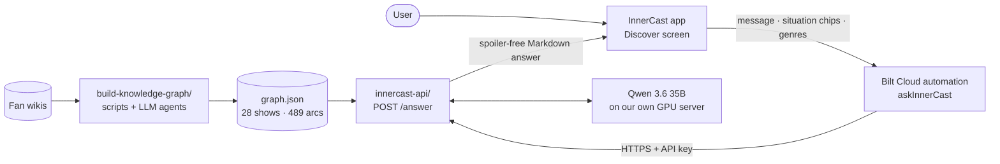

# InnerCast

**Find the character you need to watch right now.**

InnerCast is a mobile app that recommends not only *what* to watch, but *who*. You describe what you are going
through — a new job, a breakup, grief, moving to a new city — in your own words or with a few taps, and InnerCast
finds TV characters whose journey mirrors yours, explains why they might speak to you and what to watch for,
and never spoils how their story ends.

> InnerCast is for entertainment and reflection, not mental-health treatment.

## What is in this repository

| folder | what it is |
|---|---|
| repository root (`app/`, `components/`, `lib/`, …) | **the mobile app** — React Native / Expo, built with [Bilt](https://bilt.me) |
| [`build-knowledge-graph/`](build-knowledge-graph/) | **data preprocessing** — downloads fan-wiki articles, has LLM agents write each character's story arcs, checks them for spoilers, groups them into story patterns and cross-show links, and builds the knowledge graph (`qwen_server/graph.json`) |
| [`innercast-api/`](innercast-api/) | **the API** — an HTTP service that turns a user's message into spoiler-free recommendations from the graph, using a self-hosted Qwen model; plus its deployment scripts and tests |

Each folder has its own detailed README.

## How it works



**The idea: GraphRAG with a self-hosted open-weight model.** The language model never answers from memory. Code
first searches the *InnerCast Story Graph* — a curated knowledge graph of character journeys — and the model only
interprets the user's message, picks among the matches the graph returned, and writes the answer from
spoiler-safe "cards".

1. **The graph** ([`build-knowledge-graph/`](build-knowledge-graph/)). Every character journey (*arc*) is stored at
   several levels: what happens on screen, a setting-free version with no names or places, the feelings at the
   start / middle / end and the inner conflict, a story pattern shared with other shows, and a universal theme.
   That is what lets a newly promoted manager, a young prince and a hospital surgeon match the same real-life
   situation. Each arc also has a hidden spoiler block used only for choosing and for checking answers.
2. **The API** ([`innercast-api/`](innercast-api/)). For each message: the model reads it into the graph's
   vocabulary (situations, conflicts, emotions, filters, language — or recognises a crisis); code searches the
   graph and applies the genre filter; the model chooses 3 characters plus a "different world, same knot" wildcard;
   code fetches only the spoiler-free cards; the model writes the answer in the user's language; code checks it
   (only given characters, no ending phrases, questions stay questions, right language) and asks for a rewrite if
   needed.
3. **The app** (this repository's root). The Discover screen sends the typed text, the selected situation chips
   (30, e.g. *Grief*, *Burnout*, *Just need to laugh*) and genre chips (14) plus the conversation history to the
   `askInnerCast` automation in Bilt Cloud, which holds the API address and key as backend secrets, and renders the
   Markdown answer. The app itself never talks to a language model and contains no keys.

### Why not just ask a general chatbot?

- **Grounded**: answers come from a library of 489 journeys we built and checked, not from a model's memory — no
  invented characters or episodes.
- **Spoiler-free by design**: the model that writes the answer never receives how any story ends.
- **Matches the feeling, not the genre**: the levels of abstraction and cross-show links connect stories from very
  different worlds.
- **Safe**: a message that suggests a crisis gets crisis-line numbers instead of recommendations.
- **Private**: see below.

### Privacy

The model runs on our own server, not at OpenAI, Google or any other AI company, so what users write is never used
to train anyone's model. A message travels encrypted from the app through Bilt's backend and a Cloudflare tunnel to
our server, is answered there, and is not stored by the API: its log records only request times, answer times and
answer lengths, never what users wrote. (If conversation saving is switched on in the app, Bilt's database stores the user's own
conversations.)

## In numbers

| | |
|---|---|
| shows | 28 (live-action, animated, anime; US, UK, Canada, Japan, South Korea, Spain, Germany, France) |
| characters · story arcs | 237 · 489 |
| story patterns · themes | 75 · 13 |
| cross-show links | ~610, each with a one-sentence explanation |
| tap buttons | 30 situations · 14 genres |
| answer time | typically 7–9 s; up to about 30 s when an answer needs a rewrite |
| tests | all 13 test messages pass (recommendations, filters, spoiler question, crisis, German, buttons) |

## Quick start

**The app**

```sh
npm install
npx expo start          # then scan the QR code with Expo Go
```

**The knowledge graph** — Python 3.10+, standard library only:

```sh
cd build-knowledge-graph
python3 check_all.py    # run every validator, then rebuild qwen_server/graph.json
```

**The API** — Python 3.9+, standard library only; needs an OpenAI-compatible model endpoint:

```sh
cd innercast-api
cp qwen_credentials.env.example qwen_credentials.env    # fill in the model address, key and name
python3 innercast_server.py                              # GET /health, GET /options, POST /answer
```

Deployment on a Linux server (public HTTPS through a Cloudflare tunnel, systemd service) and the step-by-step
Bilt setup are described in [`innercast-api/README.md`](innercast-api/README.md) and
[`innercast-api/docs/bilt-app-guide.md`](innercast-api/docs/bilt-app-guide.md).

## Licence and attribution

- Code: MIT.
- Knowledge-graph data: CC BY-SA 4.0. The character information is derived from fan wikis, mostly on
  [Fandom](https://www.fandom.com) (CC BY-SA); the arcs are summaries written by language models from those articles.
  Two shows were removed because their wiki licences are not compatible with CC BY-SA. No wiki text is stored in
  this repository.

---

## Editing the app with Bilt

The app was built with [Bilt](https://bilt.me): [Bilt Project](https://app.bilt.me/agent/17a7e6e4-942c-4e3f-bc37-50321c67e953)
(project ID `17a7e6e4-942c-4e3f-bc37-50321c67e953`).

- **Via Bilt**: open the project and describe the change in natural language; changes are instant. Use the built-in
  preview, or **Deploy & Share** for a preview link, a web app, or App Store / Play Store releases.
- **Via code**: `npm install`, `npx expo start`, then scan the QR code with Expo Go. Built with React Native, Expo,
  TypeScript, Expo Router and AsyncStorage.
- **Via MCP**: Bilt is available as a remote MCP server at `https://mcp.bilt.me/mcp`
  ([docs](https://bilt.me/docs)).

Help: [Bilt documentation](https://bilt.me/docs) · [Discord](https://discord.gg/3FqNgmSYdZ) · support@bilt.me
