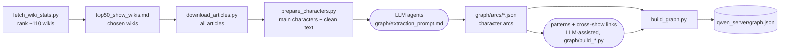

# InnerCast — character-arc knowledge graph

A knowledge graph of TV characters and the emotional journeys they go through, built so an app can
answer *"I'm going through X — which character has lived this?"* **without spoiling the show**.

This repository contains everything used to make it: the scripts that download the wiki text, the
prompts the LLM agents followed to extract character arcs, the arc data they produced, the build and
validation scripts, and the finished graph (`qwen_server/graph.json`).

- **28 shows**: live-action, animated and anime; US, UK, Canada, Japan, South Korea, Spain, Germany, France.
- **About 240 characters** and **490 story arcs**, each with a spoiler-safe hook and a hidden spoiler section.
- **Fixed vocabularies**: 36 life situations, 15 inner conflicts, 36 emotions, 16 content warnings.
- **About 75 story patterns** under 13 themes. Examples: "promoted to lead people who used to be your peers", "caught between two cultures".
- **About 610 cross-show links** ("different world, same vibe"), each with a one-line explanation.

Exact counts are in `meta.counts` inside `graph.json`.

Shows: Avatar / Korra, Grey's Anatomy, Buffy / Angel, Game of Thrones, Naruto,
Doctor Who, The Walking Dead, Breaking Bad / Better Call Saul, Stranger Things, The Office (US), Friends,
Attack on Titan, My Hero Academia, Squid Game, Ted Lasso, Schitt's Creek, BoJack Horseman, Money Heist,
Mad Men, Succession, Parks and Recreation, Brooklyn Nine-Nine, Gilmore Girls, The Good Place,
Fullmetal Alchemist: Brotherhood, Arcane, Dark, Sex Education.

## Requirements

- Python 3.10 or newer. **Standard library only**, so there is nothing to `pip install`.
- Optional: Node.js and [`zod`](https://zod.dev), to validate the graph with `graph/graph.schema.ts` in a TypeScript app.

## Quick start

The graph and all its source data are in the repo, so you can rebuild and query it without downloading anything:

```bash
python3 check_all.py        # run every validator, then rebuild qwen_server/graph.json

# query it the way the app would (spoiler-safe output)
python3 query_demo.py --situations becoming_a_manager,leading_former_peers \
                      --conflicts loyalty_vs_ambition --emotions self_doubt,anxiety
```

The vocabulary words you can query with are in `graph/vocabularies.json`.

## How the graph was made



Rectangles are scripts in this repo. Rounded boxes are LLM or hand-edited steps, whose prompts are in `graph/`.
The shows were added in three rounds (7, then 13, then 10), and steps 2 to 7 were repeated each round.
Two first-round shows, Lost and Star Trek, were later removed for licence reasons (`remove_shows.py`).
Run every command from the repo root.

### 1. Choose the wikis

```bash
python3 fetch_wiki_stats.py          # writes wiki_stats.csv (article/edit counts for ~110 TV wikis)
```

`top50_show_wikis.md` is the hand-curated table of wikis to download. `download_articles.py` reads it.

### 2. Download the articles

```bash
python3 download_articles.py                          # top 50 wikis, 6 at a time (~85 min, ~880 MB)
python3 download_articles.py --workers 3              # gentler, if the wiki host rate-limits you
python3 download_articles.py --only ted-lasso.fandom.com gilmoregirls.fandom.com   # specific wikis
```

This writes `articles/<wiki-host>.jsonl.gz`, one article per line, as wikitext. It uses the MediaWiki API
at about 1 request per second per wiki, and it is resumable: stop it any time and re-run, and finished wikis are skipped.
The progress log is `logs/download.log`.

### 3. Pick the main characters

```bash
python3 prepare_characters.py        # --top N = candidates listed per show (default 14)
```

This ranks each wiki's character pages by how many other articles link to them. It then cleans the
wikitext of the hand-picked characters (the `SHOWS` and `PICKS` tables at the top of the script) and writes:

- `characters/candidates_<wiki>.csv`: ranked candidates, to help choose.
- `characters/selected.csv`: the chosen characters.
- `characters/text/<wiki>/<character>.txt`: the cleaned article text. Not in the repo; re-create it by running this step.

### 4. Extract the character arcs (LLM agents)

This step is not a script. One LLM agent per show (or per half of a show's characters) read the
character texts and wrote `graph/arcs/<show>.json`, following **`graph/extraction_prompt.md`**. Each
arc has:

- **spoiler-safe fields**: `title`, `hook` (the situation at the *start* of the arc), `why_relatable` (questions, never answers), `watch_for`, `start_at`, `ending_tone`, `intensity`
- **a setting-free `pattern_text`**: no names, places or technology. It is the main text used for matching.
- **vocabulary links**: situations, conflicts, emotions (with phase), content warnings
- **a hidden `spoiler` block**: the full summary, key events, and what the character got right and wrong

The show list is in `graph/shows.json` and the fixed vocabularies are in `graph/vocabularies.json`. Every agent
had to get these two checks passing before handing in:

```bash
python3 validate_arcs.py graph/arcs/*.json     # vocabularies, required fields, no names in setting-free text
python3 scan_spoilers.py graph/arcs/*.json     # heuristic: spoiler words in user-facing fields (needs a human look)
```

### 5. Index the arcs

```bash
python3 make_arc_index.py                       # graph/arc_index.txt: one line per arc
python3 make_arc_index.py --out arc_index_new_round3.txt mad_men succession ...   # only the shows of one round
```

The pattern and link steps below read these index files.

### 6. Story patterns (LLM-assisted)

Patterns such as *"handed a role you never asked for"* group arcs from different shows under
13 themes. The editable tables (themes, patterns, and which arc belongs to which pattern) are in
`graph/build_patterns.py`. Later rounds were extended by agents following `graph/extend_patterns_prompt*.md`.

```bash
python3 graph/build_patterns.py && python3 graph/validate_patterns.py   # writes graph/patterns.json
```

### 7. Cross-show links (LLM-assisted)

`RESONATES_WITH` links pair arcs from *different* shows that share the same emotional knot. Each link has a
spoiler-free `bridge` sentence. The pair lists are Python tables, one file per round:

| round | pairs | output |
|---|---|---|
| 1 (5 shows) | `graph/build_resonances.py` | `graph/resonances.json` |
| 2 (+13 shows) | `graph/build_resonances_extra.py` | `graph/resonances_extra.json` |
| 3 (+10 shows) | `graph/build_resonances_extra_round3.py` | `graph/resonances_extra_round3.json` |

The agent prompts are `graph/extend_resonances_prompt*.md`. Run these commands to rebuild and check the links:

```bash
python3 graph/build_resonances_extra_round3.py
python3 graph/validate_resonances_extra.py resonances_extra_round3.json arc_index_new_round3.txt
```

### 8. Build and check the graph

```bash
python3 check_all.py
```

This runs every validator and then `build_graph.py`, which writes `qwen_server/graph.json` and
`graph/arc_id_map.json`. It then checks the result against the schema rules and prints a spoiler-scan
summary. The build replaces arc ids with neutral numbers (`arc:naruto/itachi_uchiha/1`), so ids can't leak plot.

## The graph

One JSON file with `meta`, `nodes` and `edges`. The full description is in [`graph_schema.md`](graph_schema.md), and there is
a zod schema in [`graph/graph.schema.ts`](graph/graph.schema.ts).

| node | what it is |
|---|---|
| `show`, `character` | the series and its characters (with a spoiler-safe `role`) |
| `arc` | one emotional journey of one character |
| `situation`, `conflict`, `emotion`, `warning` | the fixed vocabularies |
| `pattern` | setting-free story patterns, grouped under themes by `BROADER` edges |

Edges: `IN_SHOW`, `HAS_ARC`, `ABOUT` (arc → situation, weighted), `FACES` (→ conflict),
`FEELS` (→ emotion, at the start, middle or end), `HAS_WARNING`, `INSTANCE_OF` (→ pattern), `BROADER`,
`RELATES_TO` (character ↔ character) and `RESONATES_WITH` (arc ↔ arc across shows).

### Spoiler firewall

- Everything in `arc.spoiler` is for *choosing* arcs only. It must never reach the text shown to a user.
- Edges with `props.spoiler: true` can reveal plot: romantic, enemy and boss relations, and arc-level death, betrayal and bleak-ending warnings.
- Show-level `HAS_WARNING` edges are the safe way to warn users about content.
- `demo_leak_check.py` checks a finished answer for words from the chosen arcs' hidden key events.

## Using the graph with an LLM

[`qwen_server/`](qwen_server/) is a ready-to-deploy folder: the graph, a system prompt, and two
tool-calling functions whose output can never contain spoilers. It works with any model that supports
OpenAI-style tool calls, such as Qwen, or Llama 3.1 and later.

```bash
python3 qwen_server/qwen_tools.py --write-schema            # regenerate qwen_tools.json after a rebuild
python3 qwen_server/qwen_tools.py find_matching_characters '{"situations": ["breakup"], "emotions": ["grief"]}'
```

`demo_pipeline.py` shows the alternative two-step design: a *choosing* LLM that may see spoilers, and a
*presenting* LLM that gets only safe fields. `demo_example.md` and `demo_friend_vs_boss.md` are example answers.

## Adding a show

1. Add the wiki host to `top50_show_wikis.md`, or pass it with `download_articles.py --only <host>`.
2. Add the show to `SHOWS` and its characters to `PICKS` in `prepare_characters.py`, then run it.
3. Add the show to `graph/shows.json`.
4. Have an LLM write `graph/arcs/<show>.json` following `graph/extraction_prompt.md`. Repeat until `validate_arcs.py` passes.
5. Run `make_arc_index.py --out arc_index_new_roundN.txt <show ids>`, then assign patterns and add
   cross-show links following the `graph/extend_*_prompt*.md` prompts.
6. Run `python3 check_all.py`.

## Known quirks

- The round-1 link list (`graph/build_resonances.py`) refers to arcs by their position inside
  `arc_index.txt`. If the arc files for those 5 round-1 shows change, re-check it.
- Since Lost and Star Trek were removed, some arcs have fewer than 2 cross-show links (a few have none).
  The link validators list them as warnings.
- `check_all.py` does not regenerate `graph/arc_index.txt`. Run `make_arc_index.py` after changing arc files.
- `start_at` is where an arc *begins*. For serialised shows, recommend watching from the start of the series.

## Data sources and attribution

- The character information comes from fan wikis, mostly on [Fandom](https://www.fandom.com). Fandom text is licensed
  **CC BY-SA**. Lost (Lostpedia, CC BY-NC-ND) and Star Trek (Memory Alpha, CC BY-NC) were removed from the graph
  because their licences are not compatible with CC BY-SA.
- **This repo does not contain the wiki text itself.** `articles/` and `characters/text/` are git-ignored and are
  re-created by steps 2 and 3.
- The arc files and the graph are summaries written by LLMs, based on those wiki articles and the models'
  general knowledge of the shows. Treat them as derived from the wikis and credit them accordingly.

## Licence

For the code: MIT. For the data: CC BY-SA 4.0

---

*InnerCast is for entertainment and reflection, not mental-health treatment.*
