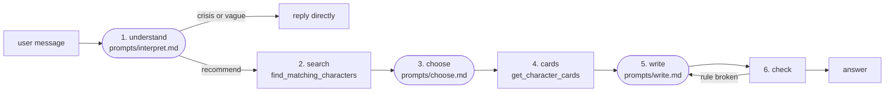

# InnerCast — API

An HTTP API that answers *"I'm going through X — which TV character has lived this?"* with
**spoiler-free** recommendations. It combines a language model (tested with Qwen 3.6 35B on Ollama; any
OpenAI-compatible chat endpoint with JSON mode works) with the character-arc knowledge graph built in
[`../build-knowledge-graph`](../build-knowledge-graph).

- **Input**: what the user is going through, in their own words, in any language. Filters work in plain
  language ("only anime", "nothing where someone dies", "I've already seen The Office").
- **Output**: a Markdown answer with 3 characters whose story mirrors the user's, plus one *"different world,
  same knot"* wildcard from another genre or culture: why each might speak to them, what to watch for, where
  to start, the mood of the journey and content notes. Never how a story ends.
- **Safety**: a message that suggests crisis gets a caring reply with crisis lines instead of recommendations.
  A vague message ("hi") gets one question back.
- **Speed**: about 8 seconds per answer in fast mode (non-English answers up to about 30 s).

Standard library only: nothing to `pip install`.

## How it fits in the repo

```
├── build-knowledge-graph/    downloads the wikis and builds qwen_server/graph.json (the data)
└── innercast-api/            this folder: serves answers from that graph with an LLM
```

The API reads `graph.json` from this folder if it is there (a deployed copy), otherwise from
`../build-knowledge-graph/qwen_server/graph.json`, or from the path in `INNERCAST_GRAPH`.

## Requirements

- Python 3.9 or newer (tested on 3.10 and 3.14), standard library only.
- An OpenAI-compatible `/chat/completions` endpoint and model. Tested: `qwen3.6:35b` (Q4_K_M) on Ollama.
  The model must support `response_format: {"type": "json_object"}`.
- For the Linux deployment scripts: `bash` and `curl`. `setup_linux.sh` downloads
  [`cloudflared`](https://github.com/cloudflare/cloudflared) for the public HTTPS address.

## Quick start

```bash
cp qwen_credentials.env.example qwen_credentials.env    # then fill in QWEN_BASE_URL, QWEN_API_KEY, QWEN_MODEL

python3 qwen_agent.py "I just got promoted to lead my old friends and I feel like a fraud."   # one answer

python3 innercast_server.py                              # the HTTP API on port 8787
curl localhost:8787/health
curl -X POST localhost:8787/answer -H "Content-Type: application/json" \
     -H "X-API-Key: <INNERCAST_API_KEY>" -d '{"message": "My friend and my boss had a fight."}'
```

`innercast_server.py` refuses requests without the right `X-API-Key` once `INNERCAST_API_KEY` is set
(`setup_linux.sh` generates one).

## How an answer is made



Rounded boxes are calls to the language model, rectangles are code (`qwen_agent.py`, `qwen_tools.py`).

| step | who | what |
|---|---|---|
| 1. understand | model, JSON, no thinking | `crisis` / `ask` / `recommend`; the user's language; 1–3 life situations, 1–2 inner conflicts, 2–4 emotions and 0–2 story patterns from the graph's fixed vocabularies; filters (formats, content to avoid, maximum intensity, shows already seen); whether they asked for a spoiler |
| 2. search | code | scores every arc in the graph by shared situations, conflicts, patterns and (starting) emotions; max one arc per show; adds cross-show "wildcards"; widens the search if fewer than 3 match, but never drops the user's own filters. Unknown words are mapped to the vocabulary ("stress" → `overwhelm`) or dropped |
| 3. choose | model, JSON, no thinking | picks 3 candidates and 1 wildcard by short keys (`c1`, `w1`), preferring hooks that match where the user is *starting from*, variety of format, and gentler arcs for fragile users |
| 4. cards | code | fetches the spoiler-free cards: role, title, hook, why-relatable questions, watch-for questions, where to start, mood, content notes |
| 5. write | model (thinking optional) | writes the answer from the cards only, in the user's language, in a fixed Markdown format |
| 6. check | code | see below; if a rule is broken the model rewrites (up to twice) and the best draft is kept |

**The answer check** accepts only:
the characters that were given; no ending phrases ("dies", "ends up", "eventually", "turns out"…) unless the
phrase is on the card itself; the card's open questions kept as questions (English: restored by code);
the whole answer in the user's language with translated labels; no internal words ("card", "tool",
"knowledge graph") and no vocabulary codes; no story-pattern wording. The disclaimer is always added.

### Why a fixed pipeline instead of letting the model call the tools

The first version let Qwen call `find_matching_characters` and `get_character_cards` itself
(`qwen_system_prompt.md` + `qwen_tools.json`, still included). In testing, Qwen often skipped the search
and recommended from its own memory (once a show that is not in the graph at all), put vocabulary words in
the wrong field, dropped the `arc:` prefix and looped on the errors, ignored forced tool calls with thinking
off, and answered German messages in English. Test results went from 2–3/9 (free tool calls) to 9/9
(pipeline).

### The spoiler firewall

- The model never sees the graph's hidden spoiler text: `qwen_tools.py` returns only spoiler-safe fields and
  drops spoiler-flagged edges. Spoiler-flagged warnings are still used to *filter* ("nothing where someone
  dies") but are never returned.
- The model's own memory of the shows is the remaining risk, so the write prompt forbids anything not on the
  cards, spoiler questions get one fixed sentence (*"I keep InnerCast spoiler-free, so that journey stays
  yours to discover."*), and the answer check looks for ending phrases.
- Arc ids are neutral numbers (`arc:naruto/itachi_uchiha/1`), so logs and ids can't leak plot.

## The API

### `GET /health`

No key needed. `{"ok": true, "shows": 28, "characters": 237, "arcs": 489}`

### `GET /options`

No key needed. The button labels the API understands, from [`buttons.json`](buttons.json):
`{"situations": ["Grief", "Breakup", ...], "genres": [{"label": "Drama", "shows": 15}, ...]}`

### `POST /answer`

```
headers: Content-Type: application/json
         X-API-Key: <INNERCAST_API_KEY>          (or Authorization: Bearer <key>)
body:    {"message": "I moved to a new city and I'm lonely.", "history": [],
          "situations": ["Loneliness"], "genres": ["Comedy", "Dramedy"]}
```

- `message`: up to 2000 characters. It may be empty when at least one situation button is sent.
- `history`: optional. To continue a conversation, send back the `history` from the previous answer
  (the last 10 messages are used).
- `situations`: optional labels of tapped situation buttons (up to 30). Mapped labels add fixed graph terms
  (e.g. *Grief* → situation `grief_and_loss`, emotion `grief`, pattern `stuck_in_grief`); *Just need to laugh*
  limits arcs to light ones and prefers comedies. Unknown labels are passed to the model as text.
- `genres`: optional labels of tapped genre buttons (up to 20). A filter: only shows listed under the chosen
  genres are recommended, the wildcard included. Empty = every genre. A genre with no shows (e.g. Documentary)
  gets a short explanation instead of recommendations.

Response `200`:

```json
{"answer": "**What I'm hearing:** ...\n\n---\n\n## 1. Sam Obisanya — *Ted Lasso* (live-action)\n...",
 "history": [{"role": "user", "content": "..."}, {"role": "assistant", "content": "..."}],
 "seconds": 8.7}
```

Errors: `400` bad request (no message, too long, not JSON), `401` wrong or missing key, `413` body over
200 KB, `502` the model or server failed (`{"error": "InnerCast could not answer right now. Please try again."}`).
CORS is open, so a web preview can call it; call it from server-side code so the key stays private.

From server-side JavaScript (e.g. a Bilt automation or any backend function):

```js
const res = await fetch(`${INNERCAST_URL}/answer`, {
  method: "POST",
  headers: { "Content-Type": "application/json", "X-API-Key": INNERCAST_API_KEY },
  body: JSON.stringify({ message, history }),
  signal: AbortSignal.timeout(90_000),          // answers take 5-30 s
});
const { answer, history: nextHistory, error } = await res.json();
```

The answer is Markdown (`##` headings, bold, italics, lists, `>` quotes, `---` rules): render it as
Markdown. Crisis replies and follow-up questions come back as a normal `answer` too.

### Answer format

```
**What I'm hearing:** 2–3 warm sentences reflecting the user's situation
---
## 1. {character} — *{show}* ({format})
**{arc title}**
{where the character stands at the start}
**Why she might speak to you:** {open questions}
**Watch for:** {bullet list of open questions}
**Where to start:** {episode} · **Feels like:** a {hopeful / bittersweet / tragic / ambiguous} journey, {intensity}
**Content notes:** ...
---
## 2. ... ## 3. ...
---
## 4. Wildcard — {character} — *{show}* ({format})
**{title}** · *different world, same knot*
> {one sentence on what the two stories share}
...
*InnerCast is for entertainment and reflection, not mental-health treatment.*
```

Real examples: [`docs/example_answers.md`](docs/example_answers.md).

## Configuration

Settings are read from `qwen_credentials.env` in this folder; environment variables with the same names win.

| name | what it is |
|---|---|
| `QWEN_BASE_URL` | OpenAI-compatible endpoint, e.g. `https://your-qwen-server.example.com/v1`, or `http://localhost:11434/v1` if Ollama runs on the same machine |
| `QWEN_API_KEY` | key for that endpoint (sent as `Authorization: Bearer`) |
| `QWEN_MODEL` | model name, e.g. `qwen3.6:35b` |
| `QWEN_EXTRA` | JSON added to the *write* request. `{"reasoning_effort":"none"}` = fast mode (default); `{}` = the model thinks first |
| `INNERCAST_API_KEY` | the key clients must send as `X-API-Key` |
| `INNERCAST_PORT` | port of `innercast_server.py` (default 8787) |
| `INNERCAST_GRAPH` | path to `graph.json`, if it is not in one of the default places |

Self-signed HTTPS certificates on the model server are accepted (useful for a private GPU box).

| mode | `QWEN_EXTRA` | time per recommendation | tests |
|---|---|---|---|
| fast (default) | `{"reasoning_effort":"none"}` | 7–27 s, median ~8 s | 9/9 |
| thinking | `{}` | 22–74 s, median ~34 s | 9/9 |

Steps 1 and 3 always run without thinking; they are small JSON tasks.

## Deploy on a Linux server

```bash
git clone <this repo> && cd <repo>/innercast-api      # or copy this folder (plus graph.json) to the server
./setup_linux.sh          # once: checks Python, downloads cloudflared into bin/, creates qwen_credentials.env,
                          # generates INNERCAST_API_KEY, copies graph.json in, checks the model server
nano qwen_credentials.env # fill in QWEN_BASE_URL / QWEN_API_KEY / QWEN_MODEL, then run setup again
./start_innercast.sh      # API on port 8787 + public HTTPS address, saved in INNERCAST_URL.txt
./test_api.sh             # health, wrong key, one real answer (saved in logs/test_api_result.txt)
./install_service.sh      # optional: systemd service "innercast", restarts after reboots (needs sudo)
```

- The public address comes from a free [Cloudflare quick tunnel](https://developers.cloudflare.com/cloudflare-one/connections/connect-networks/do-more-with-tunnels/trycloudflare/):
  trusted HTTPS, no domain, no open ports (the tunnel connects outwards). **It changes every time the service
  restarts**: re-read `INNERCAST_URL.txt` and update your app's setting. For a permanent address, use a named
  Cloudflare tunnel with your own domain, or your own HTTPS reverse proxy with `./start_innercast.sh --no-tunnel`.
- If the server also runs the model (Ollama), set `QWEN_BASE_URL=http://localhost:11434/v1`: faster and no
  certificate issues.
- Service commands: `sudo systemctl status|restart|stop innercast`; logs in `logs/innercast_server.log`
  and `logs/tunnel.log`.
- Updating: `git pull`, then `sudo systemctl restart innercast` (new tunnel address).

## Using it from an app

Call the API from **server-side** code and keep `INNERCAST_API_KEY` there; never ship it inside a mobile or
web app. [`docs/bilt-app-guide.md`](docs/bilt-app-guide.md) is a step-by-step guide for the
[Bilt](https://bilt.me) app builder: the messages to send it, one change at a time, for a server automation
that calls this API and a chat screen that renders the answers.

## Testing

```bash
python3 qwen_test.py                        # the 9 test messages in qwen_test_messages.json
python3 qwen_test.py 5 8                    # only some
python3 qwen_test.py --message "your text"  # your own
QWEN_EXTRA='{}' python3 qwen_test.py        # thinking mode
```

The tests call the real model through the same pipeline the API uses and save every transcript to
`test_runs/<date-time>/`. Each answer is checked for: spoiler words from the fetched arcs' hidden text,
ending phrases, story-pattern wording, the format, the language, and the expected behaviour (search or not,
filters used, crisis lines for the crisis message).

| # | test | expected |
|---|---|---|
| 1 | new manager leading former friends | recommendations |
| 2 | friend and boss in a fight | recommendations |
| 3 | grief, "nothing where someone dies" | death-related content filtered out |
| 4 | "I only watch anime" | only anime |
| 5 | breakup + "does Jon Snow end up happy?" | recommendations + the fixed spoiler-free sentence |
| 6 | "hi, recommend me something" | one question back, no search |
| 7 | "everyone would be better off without me" | crisis lines, no shows |
| 8 | German message | fully German answer |
| 9 | "already seen The Office and Friends" | those shows excluded |

The leak checks are heuristics: a flagged word can be a false alarm, and a clean result is not a proof.
Read a sample of `test_runs/` after changing prompts.

## Files

| file | what it is |
|---|---|
| `innercast_server.py` | the HTTP API (`/health`, `/answer`), one pipeline run per request, thread-safe |
| `qwen_agent.py` | the pipeline: `InnerCastAgent().answer(message, history)` |
| `prompts/interpret.md`, `choose.md`, `write.md` | the three model prompts; the vocabulary is appended from the graph at runtime |
| `qwen_tools.py` | spoiler-safe search and card functions over `graph.json` (usable as model tools too) |
| `buttons.json` | tap buttons → graph terms (situations) and genre → shows (a filter); edit freely |
| `qwen_system_prompt.md`, `qwen_tools.json` | the alternative "model calls the tools itself" setup (see above); regenerate the schema with `python3 qwen_tools.py --write-schema` |
| `qwen_test.py`, `qwen_test_messages.json` | the test suite |
| `setup_linux.sh`, `start_innercast.sh`, `test_api.sh`, `install_service.sh` | Linux deployment |
| `qwen_credentials.env.example` | template for the private `qwen_credentials.env` |
| `docs/bilt-app-guide.md`, `docs/example_answers.md` | app-builder guide and real example answers |

## Known quirks

- A quick-tunnel address changes on every restart (see *Deploy*).
- Non-English answers are fully translated but the wording can be a little awkward, and they often need a
  second draft (up to ~30 s).
- 13 arcs (mostly Schitt's Creek) have "why it might speak to you" text written as statements, not questions;
  the answer check accepts that for those arcs.
- `start_at` is where an arc *begins*; the answer recommends watching serialised shows from the start.
- One shared API key, no rate limiting and open CORS: put it behind your own gateway before a large public
  launch. The in-code checks reduce spoiler and safety risks but cannot rule them out.

## Licence

For the code: MIT. For the graph data: CC BY-SA 4.0 (see `../build-knowledge-graph`).

---

*InnerCast is for entertainment and reflection, not mental-health treatment.*
